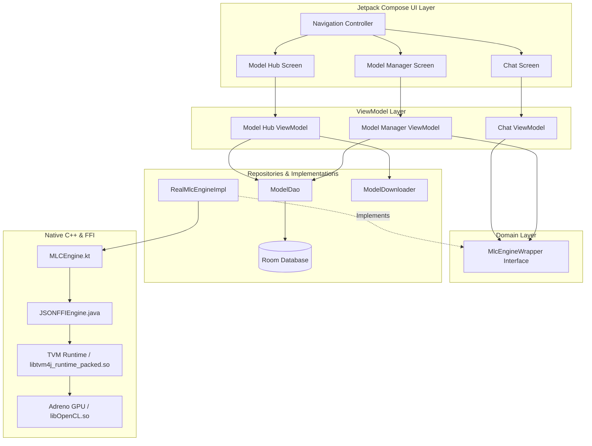

# Chatter Architecture

Chatter is an offline, privacy-first Android AI chat application built entirely using modern Android architecture components (MVVM, Jetpack Compose, Kotlin Coroutines, Hilt) and powered by **MLC-LLM (Machine Learning Compilation for LLMs)** using the **Apache TVM** compiler stack.

## High-Level Data Flow

## Low-Level Component Breakdown

### 1. Presentation & UI Layer
Built 100% in declarative Jetpack Compose, following Unidirectional Data Flow (UDF).

*   **`Navigation.kt`**: Houses the `NavHost` bridging the three primary screens.
*   **`ChatScreen` / `ChatViewModel`**: 
    *   **Responsibility**: Manages the conversational interface. Observes AI generation streams (`Flow<String>`) and updates the UI progressively (typewriter effect).
*   **`ModelHubScreen` / `ModelHubViewModel`**:
    *   **Responsibility**: Presents a list of cloud-hosted AI models (e.g., Gemma, Llama 3) available for download. Interfaces with `ModelDownloader` to stream chunks and `ModelDao` to persist successful downloads.
*   **`ModelManagerScreen` / `ModelManagerViewModel`**:
    *   **Responsibility**: Manages local models. It uses a `Dialog` to block the UI (preventing ANRs and phantom touches) while invoking `MlcEngineWrapper.loadModel` (which parses gigabytes of weights into RAM). Allows users to evict models from RAM (`unloadModel`) or delete them from storage.

### 2. Data & Domain Layer
Leverages Hilt for Dependency Injection, abstracting the raw AI engine behind clean interfaces.

*   **`MlcEngineWrapper` (Domain)**: An interface abstracting AI core functions (`loadModel`, `unloadModel`, `generateStream`). This decoupling ensures the UI is entirely ignorant of TVM's C++ complexities.
*   **`RealMlcEngineImpl` (Data)**:
    *   **Responsibility**: The concrete orchestrator bridging Kotlin Coroutines with the MLC engine.
    *   **Design**: Injects `MLCEngine` and maps generic model IDs (like `mlc-ai_gemma-2...`) to TVM-compatible system library names (`gemma2_q4f16_1...`). 
    *   **Thread Safety**: Uses `withContext(Dispatchers.IO)` to move heavy JNI/FFI blocking operations (`engine.reload()`) off the Main thread, satisfying Android's strict UI thread rules.
*   **`ModelDao` & `AppDatabase`**:
    *   **Responsibility**: Room Database interface. Persists `ModelEntity` objects tracking which models are physically present on the disk (`localPath`) to synchronize UI states across app reboots.
*   **`ModelDownloader`**: 
    *   **Responsibility**: Executes HTTP connections to HuggingFace, streaming large binary weight files (`.safetensors`, `.bin`, `.ndjson`) chunk-by-chunk to the internal `filesDir`, yielding continuous percentage updates via Kotlin `Flow`.

### 3. Native JNI & MLC-LLM Runtime Layer
The most complex subsystem, responsible for hardware-accelerated tensor operations.

*   **`MLCEngine.kt`**: The Kotlin front-end provided by the MLC ecosystem. Constructs JSON configurations (`EngineConfig`) indicating the target model paths, quantization profiles, and backend specifications.
*   **`JSONFFIEngine.java`**: The bridging class connecting Java space to C++ space (`mlc.json_ffi.CreateJSONFFIEngine`).
    *   **Core Logic**: Hardcodes `Device.opencl()` to force the TVM backend to initialize an OpenCL context before parsing weight blobs.
*   **`libtvm4j_runtime_packed.so`**: The monolithic Apache TVM runtime compiled specifically for Android `arm64-v8a`. It contains:
    1.  The TVM C++ runtime.
    2.  The OpenCL wrapper responsible for dynamic `dlopen` operations targeting Android's vendor partitions.
    3.  Statically linked computation graphs (the model architectures, like Gemma or Llama).
*   **`libOpenCL.so`**: The proprietary device GPU driver located deep in the Android OS (`/vendor/lib64/`). Permitted to interface with the app strictly via the `<uses-native-library>` manifest directive.
